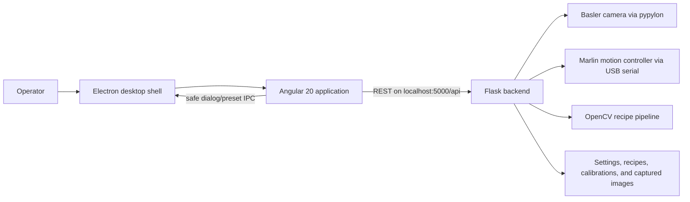

# TabletScanner

TabletScanner is a Windows-first desktop application for controlling a camera-and-motion
tablet scanner, capturing images under multiple lighting conditions, and building reusable
image-processing recipes. The operator interface is primarily Hungarian.

This document describes the repository as it exists today. For AI-assisted development rules
and cross-component change checklists, see [AGENTS.md](AGENTS.md).

The planned BTT Octopus four-channel illumination and scanner-settings redesign is tracked in
[IMPLEMENTATION_PLAN.md](IMPLEMENTATION_PLAN.md).

## Current product areas

| Area | Current state | Main source |
| --- | --- | --- |
| Scanner workspace | Implemented: device control, live view, manual capture, autofocus, and automatic measurement | `frontend/src/app/features/` |
| Recipe editor | Implemented: visual pipeline building, preview, calibration, and recipe CRUD | `frontend/src/app/features/recipe-creator/` |
| Recipe application | Placeholder only; batch application is not implemented yet | `frontend/src/app/features/recipe-applier/` |
| Desktop distribution | Implemented locally with Electron, PyInstaller, and Electron Builder | `electron/`, `build.bat` |
| Motion firmware | Marlin configuration is retained; the complete local firmware tree is not tracked | `Firmware/Marlin/` |

## Architecture



In development, Angular can run in a browser on `http://localhost:4200` while Flask runs from
source. In a packaged build, Electron loads the compiled Angular files and starts the frozen
Python backend from its resources directory.

### Frontend

- Angular `20.3.6`, Angular Material/CDK `20.2.x`, RxJS `7.8`, and TypeScript `5.9`.
- `frontend/src/main.ts` bootstraps the standalone `AppComponent` with providers from
  `frontend/src/app/app.config.ts`.
- Navigation is tab state in `SharedService`, not URL routing. The active route table in
  `app.routes.ts` is empty.
- The scanner workspace combines `motion-control`, `camera-control`, `image-viewer`, and
  `auto-measurement` components.
- Shared scanner state is held in RxJS subjects in `shared.service.ts`. Recipe state is held in
  `services/pipeline-state.service.ts`. Automatic-measurement completion and local error notices
  are published through shared state into the stacked notification area below its start button.
- API calls are split between services and feature components. All use the hard-coded base URL
  in `api-config.ts`: `http://localhost:5000/api`.
- The recipe editor fetches its step catalog from the backend, so the Python catalog is the
  runtime authority. TypeScript models mirror its schema manually.

### Backend

- `backend/app.py` creates the Flask application, exposes the REST API, initializes devices,
  and owns shutdown behavior. The file currently contains about 60 route declarations.
- `backend/globals.py` holds process-wide camera, stream, motion, autofocus, light, and latest
  image state.
- Camera access is implemented in `cameracontrol.py` with Basler Pylon. Captured camera frames
  are converted from `BayerGR10p` to copied OpenCV BGR8 arrays.
- Motion access is implemented by `porthandler.py` and `motioncontrols.py`. The controller is
  detected as USB `0483:5740`, identified with `M115`, and driven with Marlin G-code at 115200
  baud. Real hardware must report the mapping-specific marker
  `TS-LIGHT-V3-P0F0-P1F1-P2HE0-P3HE1-LOCK-RHOME`; generic or older Marlin builds are rejected.
- Autofocus and measurement helpers live in `autofocus_main.py`, `manual_bgr_with_check.py`,
  `check_only.py`, and related image-analysis modules.
- The backend starts a daemon lamp-timeout monitor and Flask may serve concurrent requests.
  Camera and serial operations therefore require the existing locks.

### Recipe pipeline

The recipe system is a linear primary pipeline with limited secondary inputs:

1. `pipeline_types.py` defines schema version 1 documents, step definitions, instances, data
   types, results, and errors.
2. `pipeline_steps.py` registers step metadata and executors. It currently contains 27
   registered operations.
3. `proc_elements/` contains most OpenCV processing implementations.
4. `pipeline_validators.py` checks structure, prerequisites, and parameters. Although backend
   types and conversion rules are declared, sequential type compatibility is not currently
   enforced by the backend validator/engine; the frontend applies its own compatibility rules.
5. `pipeline_engine.py` executes the shared data dictionary step by step and serializes preview
   outputs for the API.
6. `recipe_manager.py` and `calibration_manager.py` persist JSON data. Recipe folders are
   organizational metadata in `recipes/.recipe-folders.json`; recipe documents remain schema-v1
   JSON files and deleting a folder never deletes its recipes.

On the UI side, `models/pipeline.models.ts`, `recipe.service.ts`, and
`pipeline-state.service.ts` mirror and consume those contracts.

## Repository map

| Path | Purpose |
| --- | --- |
| `backend/app.py` | Flask entry point, API routes, device lifecycle, capture and pipeline endpoints |
| `backend/cameracontrol.py` | Camera connection, properties, acquisition, conversion, and streaming |
| `backend/porthandler.py` | Serial discovery, locking, writes, acknowledgements, and timeouts |
| `backend/motioncontrols.py` | Homing, position queries, and motion G-code helpers |
| `backend/filter_capture_series.py` | RGB/UV filter-series naming, slot resolution, and cooperative cancellation state |
| `backend/filter_series_camera.py` | Fresh still acquisition with per-frame illumination and UV deadline checks |
| `backend/autofocus_main.py` | Main autofocus and tablet-presence logic |
| `backend/pipeline_*.py` | Pipeline domain model, catalog, validation, and execution |
| `backend/proc_elements/` | Individual image-processing operations |
| `backend/settings.json` | Runtime camera and operator settings; currently contains local absolute paths |
| `backend/recipes/` | Saved schema-v1 recipe documents |
| `backend/calibrations/` | Saved curve-fit calibration records |
| `frontend/src/app/app.component.*` | Active application shell and section composition |
| `frontend/src/app/features/` | Scanner, recipe editor, and recipe application UI |
| `frontend/src/app/services/` | Recipe state/API, error, settings, readiness, and measurement services |
| `frontend/src/assets/` | Icons, UI assets, node help, and frontend error-message mapping |
| `electron/main.js` | Desktop lifecycle, frozen-backend process, native dialogs, and window creation |
| `electron/preload.js` | Context-isolated renderer bridge |
| `build.bat` | Full Windows packaging pipeline |
| `Firmware/Marlin/` | Tracked Marlin configuration and custom boot/status screens |
| `Schematic/` | Hardware drawings in Illustrator and PNG formats |

## Important runtime flows

### Startup

Running `backend/app.py` loads `backend/settings.json`, attempts to connect the first Basler
camera, starts its stream, attempts to identify the Marlin controller, starts the lamp monitor,
and then serves Flask on port 5000. Missing hardware is logged and can be reconnected from the
UI; it does not prevent the health endpoint from becoming available.

For hardware-free motion testing, enable **Beállítások → Haladó → Virtuális COM-port
használata**. On save and on subsequent startups, the backend connects to an in-process BTT
Octopus/Marlin simulator exposed as `VIRTUAL_BTT_OCTOPUS`. It supports the motion, homing,
position, stepper, status, and lamp G-code used by the application. This is an application-level
serial adapter, not a Windows driver or a system-wide COM-port pair, so external serial tools
cannot connect to it.

The packaged Electron shell starts `resources/backend/app.exe` with
`TABLETSCANNER_FULL=1`. That environment variable enables the complete API in a frozen build.
Without it, the standalone frozen backend intentionally exposes only health and latest-image
endpoints.

### Capture and automatic measurement

The UI sends motion, light, camera, and capture requests to Flask. Serial access is serialized
with `porthandler.motion_lock`; camera grabs use `globals.grab_lock`. Automatic measurement is
driven tablet by tablet by the UI through `POST /api/auto_measurement/step`, rather than by a
durable backend job queue. Progress and reconnect state therefore currently live in the Angular
component. An early progress poll returns a non-error `pending` snapshot until the corresponding
step worker registers the request. Running snapshots also expose the active plan row and nonfatal
Z-clamp warnings so the plan can follow the hardware and use the common warning presentation.

The seamless **255 / 310 / 365 / VIS / RGB+UV** control below the filter rotation controls sends
the selected wavelengths, in that order, to `POST /api/bgr-capture-series`. No lamp needs to be
active before starting. Each selected UV wavelength runs the complete Piros→Zöld→Kék sequence
and then its matching UV filter: **255 nm for 255/310 nm illumination** and **365 nm for 365 nm
illumination**. UV selections use their configured dimmed brightness and thermal timeout. VIS
runs Piros→Zöld→Kék only. Required filters must be assigned to wheel slots before starting.

The sequence uses the existing anchored/autofocused Z reference, running the configured manual
autofocus first only when no reference is available. Each filter move receives its calibrated
Z correction. Images use wavelength-qualified shared-index names such as
`folder_1_uv255_r.jpg`, `folder_1_uv255_uv.jpg`, and `folder_1_vis_b.jpg`, preventing selected
wavelengths from overwriting one another. Existing and partial sets reserve their index.
The active capture button pulses like homing; pressing it again requests cancellation, including
during autofocus. The shared capture service retains operation ownership until the backend
finishes, even when the scanner view is closed.

Automatic Z corrections clamp to the physical Z limits without changing the reference. A
dismissible yellow warning reports the missing correction, and capture continues at the limit.
JPEG ImageDescription metadata includes an `Errors` list (for example,
`["ZOffset difference: -1.5 mm"]`); the signed difference is requested Z minus actual Z.
Manual captures obtain wavelength from the active backend lamp, not client defaults.

The shared gallery retains the latest 24 images across scanner view changes. Filter-series
progress is available through `GET /api/bgr-capture-series/status` and publishes saved frames
as they complete, including partial results after cancellation or failure. Thumbnail badges
show the recorded wavelength and filter; the tray badge appears only when captured XY matches
a configured tray center within 0.01 mm. Metadata is returned with new captures and can be
read from saved JPEG EXIF through `GET /api/image-metadata?path=...`.
Hardware acceptance should include clamping at both Z limits, dismissing the warning while
capture continues, checking the saved `Errors` and wavelength fields, and comparing tray badges
before and after a 0.1 mm manual XY move.

For capture, illumination is switched off during filter/Z motion and JPEG saving, then activated
afresh for each image. Acquisition restarts under the camera lock to discard old preview frames.
After acknowledged filter and Z completion, a 0.5-second settling interval precedes illumination.
The lamp then gets another 0.25 seconds to settle. The first newly acquired frame is discarded as
an exposure-scaled guard frame; the following frame is saved, so its exposure starts only after a
complete camera cycle under the selected lamp. Live view continues acquiring during autofocus
movement and calculation, filter/Z motion, settling, and saving, including dark frames when the
lamps are off. Only individual autofocus grabs and the protected guard/capture pair suppress
preview acquisition; their acquired frames are shared with the live view without competing for
the camera queue. The stream does not wait on an owned camera lock to publish these frames. UV
thermal timeouts remain enabled; both acquisitions must fit the safety window, exposures that cannot
fit are rejected, and frames acquired after illumination is lost are not saved. A transient camera
grab receives one new, fully safety-checked attempt. Each acquisition is bounded to 30 seconds
(exposure below 29 seconds). Cancellation and errors attempt to switch every lamp off. After a
successful RGB or RGB+UV series, VIS is activated; this leaves VIS selected after a VIS cycle and
replaces UV with VIS after a UV cycle.

The Settings → Kamera panel stores ExposureTime and Gain for four filter groups (empty,
shared Kék/Zöld/Piros, 255 nm, and 365 nm) across all four illumination channels. Switching either the active lamp or filter applies that matrix cell
to the camera and updates the scanner camera controls; Gamma remains global. Schema v10 seeds
the matrix from the previous global ExposureTime/Gain values and preserves unchanged cells when
filters are edited. Schema v11 enables a configurable pre-X/Y collision guard: when selected under
**Beállítások → Haladó**, an X/Y move first lowers Z to 35 mm by default if it is above that limit.
The limit is editable from 0–40 mm. Schema v13 adds automatic-measurement toggles for the
autofocus-reference image and missing-tablet check while preserving both former enabled behaviors
during migration. Capture metadata rounds XY/Z to four decimals, exposure to an integer, and
gain/gamma to four decimals before JSON is embedded in EXIF.

The configured tray is a 10×10 grid. Motion limits are currently 0–175 mm on X, 0-165mm on Y, and 0–40 mm on
Z. Treat those limits, homing order, lamp timeouts, and light-interlock behavior as hardware
safety constraints.

### Four-channel illumination configuration

The Octopus illumination controller has four logical channels: `uv255`, `uv310`, `uv365`, and
`vis`. The approved firmware and schema-v9 settings lock these to `P2/HE0`, `P3/HE1`, `P1/FAN1`,
and `P0/FAN0` respectively; **Beállítások → Haladó** displays the mapping for verification.
Configure dimmed/full percentages and their UV safety timeouts in
**Beállítások → Lámpa**. UV channels use one click for dimmed and double click for full output;
VIS is a single-click 100% channel without a thermal timeout.

Automatic measurement requires a non-empty `capture_plan`; legacy `lamp_top`/`lamp_side` payloads
are rejected. Each plan row records a wavelength, brightness mode, filter position, exposure time,
and gain. UV rows select Tompított or Teljes in the Fény dropdown; VIS is always full brightness.
The first row remains read-only and follows the illumination and filter combination selected under
**Beállítások → Fókusz**; its three camera values also supply autofocus. UV brightness mode is
selected in the same panel. Gamma remains a global camera setting. Live camera limits and increments
validate the camera values before capture. Filter positions are stored in output metadata.

Automatic measurement still homes the A axis against its physical slot-1 reference for safe,
known positioning, then immediately rotates to the configured autofocus filter before moving to
the first tablet.

During automatic measurement, normal live acquisition continues through XY/Z and filter movement.
Only the exact autofocus, presence-check, and capture grab is given priority over the MJPEG stream;
that acquired frame is then published to the live view. This keeps the moving scanner visible while
preventing preview acquisition from removing a frame required by the measurement sequence.
Autofocus acquisition frames are not saved directly. Under **Beállítások → Automata mérés**, the
operator can also disable saving the capture plan's first, autofocus-reference row. Its camera
values continue to drive autofocus, but that row then creates neither a file nor a gallery item.
The same panel can disable the missing-tablet check used on tablets where autofocus is not rerun.
When enabled, that check explicitly restores the configured autofocus filter, illumination, and
camera values before acquiring its frame. Each enabled planned image is published to the gallery
as soon as it is saved. Captured metadata uses ASCII-safe escaped JSON in JPEG EXIF, so Hungarian
filter names survive the metadata reload used by automatic-measurement thumbnails.

The six revolver positions and reusable filter definitions (name, wavelength range, and display
color) can be configured under **Beállítások → Szűrőváltó**. The **Fókusz** page stores the autofocus
light/filter selection and a separate height offset for every configured-filter/illumination
combination, plus the physical empty-filter row. The selected autofocus light/filter pair is
displayed as **0 mm**, with every other cell relative to it. Changing the selection recalculates
the display without rewriting calibration; edits are converted back to the existing blue/VIS
master calibration, so saved settings remain compatible.

Before autofocus acquisition, the backend turns illumination off, completes and settles the
configured filter movement, applies and verifies the ExposureTime/Gain matrix cell for the
configured autofocus light/filter pair, stops the previous preview acquisition, activates and
settles the autofocus lamp, and only then restarts acquisition. This prevents a queued frame using
the previously selected capture settings from becoming the first autofocus frame.

Automatic Z corrections become available after successful manual autofocus or by pressing the
**anchor button attached to the Z coordinate input**. Successful manual autofocus automatically
activates the anchored state. The anchor records the current physical Z
for the currently active light/filter pair without running autofocus or moving Z. It stays blue
through filter/light corrections and XY moves; a manual Z change or a second press clears it.
Homing, motor-off, disconnect, and filter calibration/slot changes also clear the reference.
The runtime reference is owned by `height_offset_control.py`; `height_reference_api.py` exposes
read-only status and explicit POST enable/disable at `/api/height-offset/reference`.
After the A axis is
homed—either by the regular full homing operation or separately from the Home button's
right-click menu—the Vezérlőpult can move the physical revolver one 60° slot at a time. The UI
updates its active filter only after the controller acknowledges the completed move.

The required board mapping, command contract, and hardware bring-up checks are in
[docs/HARDWARE_LIGHT_PROTOCOL.md](docs/HARDWARE_LIGHT_PROTOCOL.md).

### Errors and settings

Most actionable API failures use an object resembling
`{ "error": "...", "code": "E1111", "popup": true }`, but older endpoints are not fully
uniform. The Angular HTTP interceptor maps error codes through
`frontend/src/assets/error_messages.json`. That file currently matches
`backend/error_messages.json`; changes need to keep both copies synchronized.

Settings are cached in memory and written back to `backend/settings.json`. Recipes and
calibrations are also mutable JSON files. These files are tracked today, so using the UI can
change the working tree and can expose workstation-specific paths in a commit.

## Local development

### Prerequisites

- Windows for the complete hardware and desktop workflow.
- Python with `pip`. No Python version is declared by the repository; use a version supported by
  the installed Basler Pylon stack.
- Node.js and npm. No Node version is declared by the repository.
- Basler Pylon runtime/driver and a compatible camera for camera functions.
- A Marlin controller matching USB `0483:5740` for motion and light functions.

The backend dependency list is currently unpinned and incomplete:
`cameracontrol.py` imports `requests`, but `backend/requirements.txt` does not declare it.
Install it explicitly until the dependency file is corrected.

### Run the backend

```powershell
cd backend
python -m pip install -r requirements.txt
python -m pip install requests
python app.py
```

The API is available at `http://localhost:5000/api`; `GET /api/health` is the simplest process
liveness check. It always reports ready and does not prove that settings, camera, or motion
initialization succeeded. Starting the backend automatically probes real hardware, so expect
connection warnings on a development machine without the devices.

### Run the frontend

In another terminal:

```powershell
cd frontend
npm ci
npm start
```

Open `http://localhost:4200`. Native Electron dialogs are unavailable in the browser; relevant
features fall back to backend/Tkinter dialogs where implemented.

### Build the desktop application

From the repository root:

```powershell
.\build.bat
```

The script interactively offers to install dependencies, freezes the backend with PyInstaller,
builds Angular with a relative base path, copies it into Electron, runs Electron Builder, and
places the unpacked application at:

```text
release/win-unpacked/TabletScanner.exe
```

PyInstaller is not declared in `backend/requirements.txt`; answer `y` to the dependency prompt
or install it separately. Electron development via `npm start` is not a live full-stack mode: it
expects both a prebuilt `backend/dist/app/app.exe` and compiled files in `electron/app`.

## Verification and current baseline

Available checks:

```powershell
# Backend processing smoke test
cd backend
$env:PYTHONUTF8 = '1'
python test_select_channel.py

# Frontend checks
cd ..\frontend
npm run build
npm test -- --watch=false --browsers=ChromeHeadless
```

As of this overview:

- `backend/test_select_channel.py` passes its five assertions with UTF-8 console output. It is a
  standalone script, not a pytest suite.
- The production frontend build compiles but exits nonzero because
  `step-inspector.component.ts` exceeds the configured component-style budget. The initial
  bundle also exceeds the warning budget.
- The headless frontend test run reports 10 failing specs. The immediate failures include an
  invalid standalone-component test setup, an empty suite, and stale Angular starter tests.
- There is no lint command, backend test configuration, end-to-end test target, or CI workflow.

These are baseline failures, not evidence that a new documentation-only change caused a
regression.

Focus-reference checks: run `python -m unittest test_height_offset_control test_height_reference_api`
in `backend/`. The focused Angular specs are `focus-offsets.spec.ts`,
`focus-anchor.component.spec.ts`, and `software-settings-focus.spec.ts`; these cover the displayed
zero, saved calibration conversion, anchor toggling, and stale status responses. On hardware,
verify autofocus with a non-blue/VIS selection, then anchor a manually adjusted Z, switch through
several filter/light pairs and back, move XY, and jog Z. The return move must recover the anchored
Z, XY must preserve the anchor, and the Z jog must clear it. Also verify homing, motor-off, and
disconnect clear the anchor. No settings schema or packaging-input change is required.

Filter-series checks: `python -m unittest test_filter_capture_series test_filter_series_camera test_light_control`
covers order, wavelength mapping, autofocus/anchor reuse, cancellation, and UV deadline handling
without hardware. `filter-capture-buttons.component.spec.ts` covers wavelength selection, button
readiness, progress, cancellation, and retaining request ownership after view destruction. On
hardware, verify RGB and UV capture with every wavelength selection, confirm sequence order,
metadata/Z and wavelength-qualified filenames, test a UV timeout, and cancel during autofocus
and capture. Confirm the Z anchor uses the normal active-button
blue and fits the coordinate box in the desktop layout. Packaging inputs are unchanged; the new
Python acquisition module is a static import and uses the existing Pylon dependencies.

## Reproducibility gaps to resolve early

The current local working copy can do more than a fresh clone is likely to support:

1. The root `.gitignore` excludes the entire `electron/` directory even though it contains
   required source files (`main.js`, `preload.js`, and `package.json`). Those paths do not appear
   to be tracked, so a fresh clone cannot run `build.bat` as written.
2. Only four Marlin configuration/screen headers are tracked. The complete local firmware tree
   is stored in ignored `Firmware.rar`, and there is no verified build/flash procedure.
3. Python dependencies and runtime versions are not pinned or fully declared.
4. `backend/settings.json` contains machine-specific paths. Packaged settings can therefore
   refer to files that do not exist on the target workstation.
5. Packaging includes settings and error messages, but not the default recipe/calibration data
   or the tracked camera profile.
6. Large UI components and the route-heavy `backend/app.py` concentrate many responsibilities,
   while automated coverage is currently too small to protect major refactors.
7. The frontend currently calls `POST /api/disable_steppers`, but no matching Flask route is
   registered.
8. The local Flask API enables unrestricted CORS and includes raw G-code plus arbitrary local
   file operations. Keep it bound to localhost; it is not designed as a network service.

For major UI/backend work, first make the affected API and data contract explicit, then add
focused tests around that seam before moving responsibilities between components.
